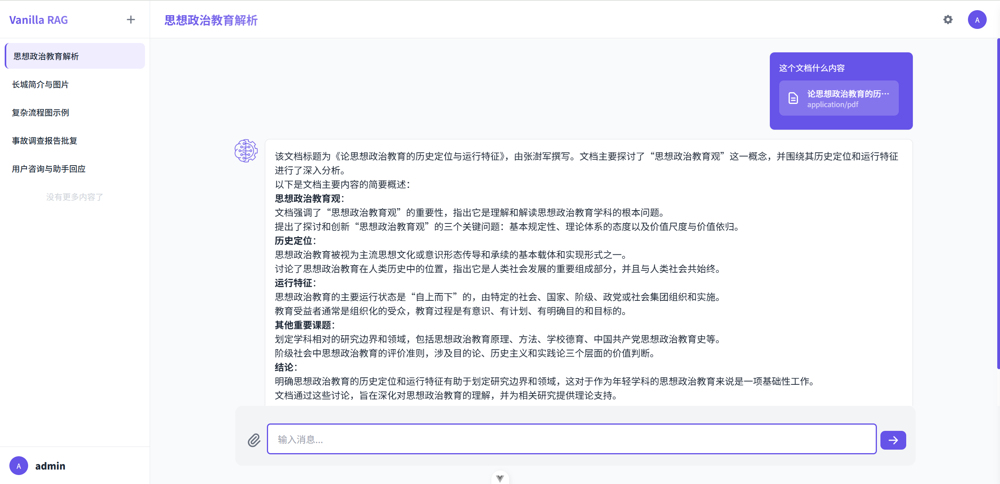

# Vanilla RAG

## 🌟 Project Background

With continuous improvements in the contextual understanding capabilities and fundamental performance of large language
models, best practices for advanced **RAG (Retrieval-Augmented Generation)** techniques are constantly evolving.
However, the core mechanisms of **Native-RAG** will largely remain stable over a significant period.

The goal of this project is to provide a **native**, lightweight, and easy-to-understand implementation of RAG, helping
developers quickly get started and master the fundamental principles of RAG technology.

---

## 💡 Development Motivation

There are already many excellent open-source RAG implementations on the market, but they often come with steep learning
curves or complex project structures, which can be unfriendly for AI enthusiasts or small-to-medium-sized teams.

Therefore, we created **Vanilla RAG**: a **minimalist, transparent, and framework-free** RAG system implementation that
allows developers to easily get hands-on experience and deeply understand the underlying logic of RAG.

---

## 📦 Project Overview

This project is an open-source simplified version of the internal RAG platform at the **Nanjing Tsingzhan Artificial
Intelligence Research Institute**, and it embraces the **MCP (Model Context Protocol)**.

Consistent with its name, we strive to implement RAG functionality in the most "native" way possible—using only minimal
dependencies such as utility functions from [Haystack-ai](https://github.com/deepset-ai/haystack), and **no reliance on
any complex AI frameworks**, making it easy to understand and suitable for secondary development.

---

## 🧱 Project Structure

### `rag/` — Core RAG Server Code

- Contains two submodules:
    - `server`: Backend code for knowledge base management services.
    - `core`: The core implementation logic of Native-RAG.

### `inference/` — Model Inference Module

- Utilizes the following models to support key functionalities:
    - **[Surya-OCR](https://github.com/VikParuchuri/surya)**: For document recognition.
    - **[BAAI/bge-m3](https://huggingface.co/BAAI/bge-m3)**: For text embedding.
    - **[BAAI/bge-reranker-v2-m3](https://huggingface.co/BAAI/bge-reranker-v2-m3)**: For re-ranking retrieval results.

### `mcpserver/` — MCP Protocol Server Demo

- Provides the following auxiliary features:
    - PDF rendering.
    - Text-to-image generation capability using Pollinations-AI.

### `web/` — Lightweight Frontend Interface

- Supports the following features:
    - Knowledge base management UI.
    - Chat interaction interface.
    - Markdown incremental rendering + Mermaid diagram + LaTeX formula support.
    - File upload parsing + integration with MCP functionality.

---

## ⚙️ Quick Start Guide

### Prerequisites

- Python 3.11+
- [`uv`](https://github.com/astral-sh/uv) (Python package manager)
- Node.js (for frontend)
- Milvus 2.5.x

### Launch Steps

#### Frontend Project (`web`)

```bash
cd web
npm install
npm run dev
```

#### Backend Projects (`rag`, `inference`, `mcpserver`)

```bash
cd rag
uv sync
uv run python main.py
```

Then visit http://localhost:8883

### Configuration Details

- `rag/config.yaml`: Configure Milvus server address, MCP service address, and model service addresses.
- `inference/config.yaml`: Configure OCR concurrency settings; for more details,
  see [surya-ocr](https://github.com/VikParuchuri/surya).

> Other modules follow the same pattern—simply switch directories and execute the same commands.

---

## ⚠️ Trademark & Disclaimer

> All logos and brand identifiers used in this project related to the **Nanjing Tsingzhan Artificial Intelligence
Research Institute** are trademark assets of their respective legal holders.  
> Use of these identifiers for derivative projects' promotion, packaging, or branding is prohibited without written
> permission.  
> This project adopts the GPLv3.0 open-source license, which does not grant any rights to trademarks.

> The content and technical implementations within this project are provided solely for educational and communication
> purposes. They do not represent official positions or endorsements.  
> If you have any questions or collaboration intentions regarding this project, please contact us via the following
> link: [Nanjing Tsingzhan Artificial Intelligence Research Institute](https://tsingzhan.com/).

## Demo

RAG  
Mermaid Diagram  
LaTeX Formula  
File Chat
MCP Text-to-Image  
MCP Multi-Modal
MCP Text2SQL Agent

## Roadmap

- [ ] Lower-level Native-RAG implementation
- [ ] Support for Ollama
- [ ] Support for multiple MCP services
- [ ] Implementation of RAG-MCP